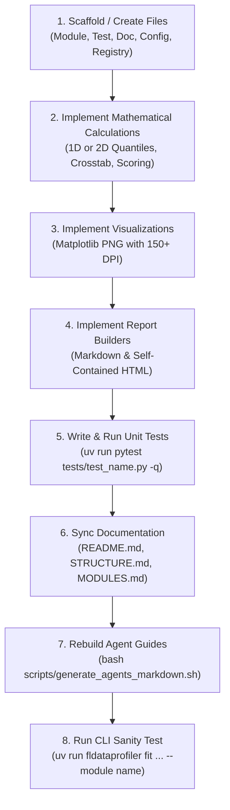

# Profiling Module Development Skill (`create-module`)

Use this skill when building a new quantitative profiling module in `fl-data-profiling`. Every module must implement the standardized `ProfilingModule` interface, produce the 6 mandatory artifacts, respect downsampling vs `--full` mode, register aliases, provide comprehensive documentation, and pass strict unit test verifications.

---

## 7 Core Principles & Architectural Rules

1. **Protocol Implementation**:
   Each module must live in `src/fldataprofiler/modules/<name>.py` and implement `ProfilingModule`:
   ```python
   def run(
       self,
       feature_csv: Path,
       label_csv: Path,
       output_dir: Path,
       join_key: str | None = None,
       targets: list[str] | None = None,
   ) -> ModuleResult:
       ...
       return ModuleResult(report_dir=run_dir, artifacts=artifacts)
   ```

2. **Mandatory 6-Artifact Output Contract**:
   Every module run must generate standard artifacts in `reports/<module_name>/`:
   - `report.md`: GitHub-flavored Markdown report with Executive Summary, ranking tables, and image embeds.
   - `report.html`: Self-contained interactive HTML web report with styled KPI metric cards and tables.
   - `summary.json`: JSON metadata (`created_at`, `execution_time`, `shapes`) + top results.
   - `*.csv` (Primary): E.g., `feature_scores.csv` or `pair_coverage_scores.csv`.
   - `*.csv` (Breakdown/Details): E.g., `quantile_crosstab_probabilities.csv` or `cell_details.csv`.
   - `*.png`: Visual distribution chart or heatmap ($\ge 150$ DPI).

3. **Subsampling & `--full` Compatibility (Rule 4)**:
   Always use `_sample_rows(merged, max_rows=MAX_ROWS, random_state=RANDOM_STATE)` so the `--full` CLI flag works via `_FULL_ROW_MODE`.

4. **Multi-Stage Progress Reporting**:
   Wrap calculation pipeline with `with ModuleProgress(self.name, total=4) as progress_bar:` and call `progress_bar.step(...)` at each major phase.

5. **Config Protocol**:
   - Register default parameters in `src/fldataprofiler/config.default.json`.
   - Read configs via `get_module_config("<name>")` with fallback default constants.

6. **Registry & Aliasing**:
   Register in `src/fldataprofiler/registry.py` under `_MODULES` dictionary with clean aliases (e.g. `module_name`, `modulename`, `short_alias`).

7. **Documentation & Architecture Synchronization (Rule 1)**:
   Whenever a module is added, you **MUST** update:
   - Dedicated documentation: `docs/<name>.md`.
   - Master taxonomy and table: `docs/README.md`.
   - Project structure: `docs/.ai/STRUCTURE.md`.
   - Module catalog: `docs/.ai/MODULES.md`.
   - Rebuild agent guides: `bash scripts/generate_agents_markdown.sh`.

---

## Fast Scaffolding with `new_module.py`

To quickly generate boilerplate code, test, documentation, config entry, and registry wiring:

```bash
uv run python .agents/skills/create-module/scripts/new_module.py \
  --name probability_entropy \
  --class-name ProbabilityEntropyModule \
  --description "Quantile Shannon Entropy & Information Gain Profiling" \
  --aliases "entropy,prob_entropy"
```

This generates:
- `src/fldataprofiler/modules/<name>.py` (Starter template with progress, HTML/MD builders, CSV writers)
- `tests/test_<name>.py` (Unit tests covering registry, math, and artifact generation)
- `docs/<name>.md` (Documentation template)
- Updates `src/fldataprofiler/config.default.json`
- Updates `src/fldataprofiler/registry.py`

---

## Step-by-Step Implementation Workflow



---

## Reference Patterns & Code Templates

### Pattern A: 1 Feature $\times$ 1 Label Crosstab & Quantile Percent Matrix
```python
# 1. Discretize into quantiles
bins = pd.qcut(x_series.rank(method="first"), q=n_quantiles, labels=False) + 1

# 2. Crosstab & Row-Normalized Percent (%)
ct_count = pd.crosstab(bins, target_series)
ct_pct = ct_count.div(ct_count.sum(axis=1), axis=0) * 100.0

# 3. Filter qualified bins exceeding threshold
qualified_mask = (ct_pct[target_class] >= min_probability * 100.0) & (ct_count.sum(axis=1) >= min_support)
qualified_bins_count = qualified_mask.sum()
```

### Pattern B: 2D Feature Pair $\times$ Label Joint Grid Matrix
```python
# 1. Discretize both features
bx = pd.qcut(x1.rank(method="first"), q=n_bins, labels=False) + 1
by = pd.qcut(x2.rank(method="first"), q=n_bins, labels=False) + 1

# 2. Joint evaluation per cell (bx, by)
cell_samples = ((bx == i) & (by == j)).sum()
cell_events = ((bx == i) & (by == j) & (target == target_class)).sum()
prob = cell_events / cell_samples if cell_samples > 0 else 0.0
```

---

## Verification & Quality Checklist

Before completing any module, verify all 8 items in [quality-checklist.md](references/quality-checklist.md):

1. `uv run pytest tests/test_<name>.py -q` $\to$ 100% Passed.
2. `uv run fldataprofiler fit datasets/feature.parquet datasets/label.csv --module <name> --limit 1000` $\to$ Exit code 0.
3. Check `reports/<name>/`: Ensure `report.md`, `report.html`, `summary.json`, `*.csv`, `*.png` exist.
4. Confirm `docs/README.md`, `docs/.ai/STRUCTURE.md`, `docs/.ai/MODULES.md` are updated and `generate_agents_markdown.sh` was run.
