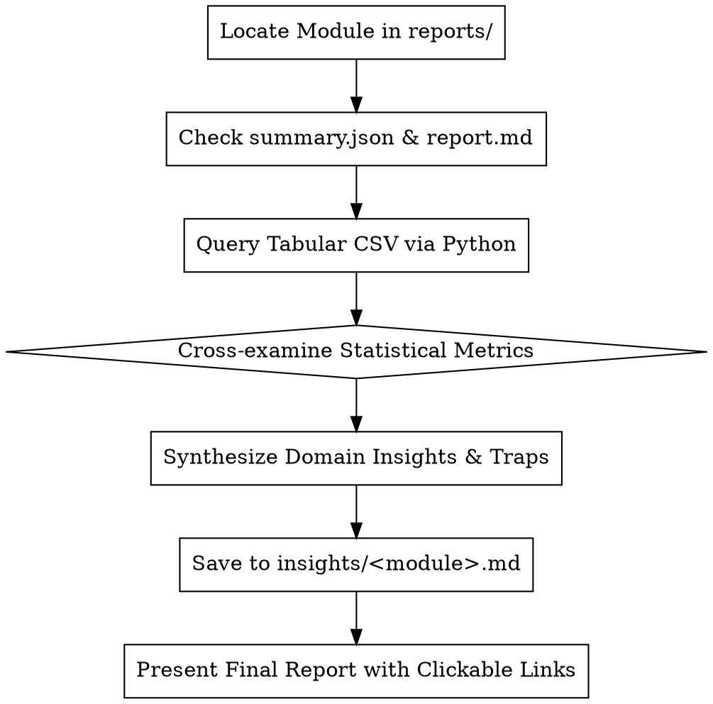

# Extracting and Saving Insights from Profiling Reports (`get-insights`)

## Overview

The `get-insights` skill defines the standard protocol for reading, querying, interpreting, synthesizing, and **saving** domain and statistical insights from profiling run artifacts located in `reports/<module>/` to structured markdown documents in `insights/`.

Raw numbers and metric tables are only the first step. High-value insights connect statistical evidence (Information Value, Probability Spread, Monotonicity, IC decay, SHAP attribution, clustering regimes) to actionable domain rules (e.g., entry gates, regime filters, stop-loss/take-profit zones, feature pruning) and persist them as permanent, version-controlled markdown files in `insights/<module_name>.md`.

---

## When to Use

- When asked to read, explain, or summarize any report in `reports/` (e.g., `reports/probability/`, `reports/alphalens/`, `reports/eda/`, `reports/xgboost/`, etc.).
- When asked to extract and save insights into the `insights/` directory.
- When comparing feature predictive power across targets, classes, or market regimes.
- When formulating quantitative trading rules, feature engineering strategies, or ML feature selection from profiler results.
- When validating model/factor performance and diagnosing data artifacts (e.g., rare-event WoE inflation, lookahead leakage, multicollinearity).

---

## Profiling Report Categories & Artifact Contracts

Every profiling module writes standard artifacts to `reports/<module_name>/`:

| Report Category | Key Artifacts | Primary Focus |
| :--- | :--- | :--- |
| **Probability & Rules** (`probability`, `probability_2d`, `probability_3d`, `probability_bayes`, `probability_drift`, `probability_scorecard`, `probability_prim`, `probability_markov`, `probability_kellycriterion`) | `feature_probability_scores.csv`, `quantile_conditional_probabilities.csv`, `summary.json`, `report.md` | Non-linear conditional probabilities, Quantile spreads ($\Delta P$), IV, Monotonicity, Sweet spots, Scorecards, Kelly sizing |
| **Factor Tearsheets** (`alphalens`, `information_coefficient`, `signal_analysis`, `timeseries_importance`) | `factor_metrics.csv`, `quantile_returns.csv`, `ic_decay.png`, `summary.json` | Walk-forward IC, Information Ratio (IR), Quantile monotonic returns, IC decay half-life, Turnover |
| **Feature Selection & ML** (`lightgbm`, `xgboost`, `shap`, `mrmr`, `boruta`, `mutual_information`, `stability_selection`, `permutation_importance_ts`) | `feature_scores.csv`, `top_features.csv`, `shap_values.png`, `summary.json` | Non-linear feature importance, Gini/Gain, SHAP interaction values, Permutation drops |
| **Statistics & Regimes** (`eda`, `statistics`, `statsmodels`, `scipy`, `kmean`, `regime_scoring`, `visual_regions`) | `columns_profile.csv`, `numeric_summary.csv`, `kmean_results.csv`, `summary.json` | Distribution moments (skew, kurtosis), Stationarity tests, Multicollinearity, Regime clusters, 2D decision regions |

---

## Step-by-Step Insight Extraction Protocol



### Step 1: Locate & Scan High-Level Artifacts
Inspect `reports/<module>/report.md` and `reports/<module>/summary.json` to extract:
- Feature file and label file used.
- Sample row count and execution timestamp.
- Target variables and distinct classes evaluated.
- Global top features and summary metrics.

### Step 2: Query Underlying CSV Data via Python
Do not rely solely on truncated top-10 tables in `report.md`. Always run a targeted Python script using `uv run python` to inspect distributions and cross-sections in the CSV files:

```python
# Example: Fast inspection of feature_probability_scores.csv
import pandas as pd

df = pd.read_csv("reports/probability/feature_probability_scores.csv")

# Filter by target and get top features by spread, IV, and monotonicity
for target in df["target"].unique():
    sub = df[df["target"] == target]
    for cls in sub["target_class"].unique():
        cls_df = sub[sub["target_class"] == cls]
        print(f"Target: {target} | Class: {cls} (Base Rate: {cls_df['base_rate'].iloc[0]:.4f})")
        top_spread = cls_df.sort_values(by="prob_spread", ascending=False).head(3)
        for _, r in top_spread.iterrows():
            print(f"  Spread: {r['feature']} -> spread={r['prob_spread']:.4f}, max={r['max_prob']:.4f}, mono={r['monotonicity']:.3f}, IV={r['information_value']:.3f}")
```

### Step 3: Interpret Quantitative Metrics in Domain Context

Translate raw numbers into domain meaning:
- **High Spread ($\Delta P > 0.30$) with high Monotonicity ($|\rho| > 0.80$)**: Direct linear / monotonic signal. Ideal for directional filtering, scoring rules, or linear models.
- **High Spread ($\Delta P > 0.30$) with low Monotonicity ($|\rho| < 0.30$)**: Non-monotonic / U-shape relationship. Ideal for sweet-spot boundary detection (e.g., extreme oversold/overbought zones).
- **High IV ($> 0.5$) with reasonable Base Rate ($> 2\%$)**: Strong predictive factor.
- **Factor Monotonic Returns (Quantile 1 to Quantile 5/10)**: Validates continuous alpha vs binary noise.
- **IC Decay**: Fast decay ($< 3$ bars) indicates short-lived execution signal; slow decay ($> 15$ bars) indicates macro/regime trend factor.

### Step 4: Detect & Flag Statistical Pitfalls
Always verify against common data artifacts:
1. **Rare Class WoE / IV Inflation**: If target class base rate is $< 0.5\%$, WoE can blow up ($IV > 10.0$) due to zero-sample bins or small denominators. Always check sample counts and probability spread rather than IV alone.
2. **Survivorship & Subsampling Effects**: Check if run was done with sample limit (`model_rows`) or `--full`.
3. **Collinear Duplicates**: Group related features (e.g. `session_body_pct`, `session_body_rate`, `session_mom_y`) rather than reporting them as 10 independent discoveries.

### Step 5: Save Insights to `insights/<module_name>.md`
Save the synthesized findings into a permanent, version-controlled markdown file in the `insights/` directory:
- Path convention: `insights/<module_name>.md` (e.g., `insights/probability.md`, `insights/alphalens.md`).
- Ensure the `insights/` directory exists (create it via `mkdir -p insights` if needed).
- Follow the **Saved Insights Markdown Template** below.

### Step 6: Present Output with Clickable Links
Present the final insights in the user conversation with direct, clickable markdown links:
- Link to the saved insight file: `[insights/<module_name>.md](file:///abs/path/to/fl-data-profiler/insights/<module_name>.md)`
- Link to source report artifacts: `[report.md](file:///abs/path/to/fl-data-profiler/reports/<module_name>/report.md)`

---

## Saved Insights Markdown Template (`insights/<module_name>.md`)

```markdown
# Quantitative & Domain Insights: <Module Name>

## Executive Summary
- **Primary Finding 1**: ...
- **Primary Finding 2**: ...
- **Primary Finding 3**: ...

## Data & Scope Metadata
- **Source Report**: [reports/<module>/report.md](file:///path/to/reports/<module>/report.md)
- **Features Evaluated**: N
- **Targets Evaluated**: target_1, target_2, ...
- **Sample Size / Mode**: 50,000 rows (subsampled / full)

## Target-by-Target Insights & Rules

### 1. Target: `<target_name>`
- **Core Dynamics**: ...
- **Top Predictive Features**:
  | Feature | Class | Base Rate | Max Prob | Spread ($\Delta P$) | Monotonicity | Primary Metric (IV/IC/Gain) |
  | :--- | :--- | :---: | :---: | :---: | :---: | :---: |
  | `feature_a` | `cls_1` | 20.0% | 68.0% | 48.0% | +0.98 | ... |

## Actionable Strategy & Trading Rules
- **Rule 1 (Time/Regime Gate)**: IF `feature_a` > threshold THEN ...
- **Rule 2 (Entry Trigger)**: IF `feature_b` in [lower, upper] THEN ...
- **Rule 3 (Reversal / Mean-Reversion)**: IF `feature_c` extreme THEN ...

## Statistical Pitfalls & Cautions
- **Overfitting / Rare Events**: ...
- **Multicollinearity**: ...

## Source Artifacts
- [report.md](file:///path/to/reports/<module>/report.md)
- [summary.json](file:///path/to/reports/<module>/summary.json)
- [feature_scores.csv](file:///path/to/reports/<module>/<scores>.csv)
```

---

## Python Query Reference Snippets

### 1. Probability Modules (`probability`, `probability_2d`, `probability_scorecard`)
```bash
uv run python -c "
import pandas as pd
df = pd.read_csv('reports/probability/feature_probability_scores.csv')
print(df.nlargest(10, 'prob_spread')[['feature', 'target', 'target_class', 'prob_spread', 'monotonicity', 'information_value']])
"
```

### 2. Alphalens & IC Modules (`alphalens`, `information_coefficient`)
```bash
uv run python -c "
import pandas as pd
df = pd.read_csv('reports/information_coefficient/top_features.csv')
print(df.head(10)[['feature', 'mean_ic', 'ic_std', 'ir', 'p_value']])
"
```

### 3. Tree Feature Importances (`lightgbm`, `xgboost`, `shap`)
```bash
uv run python -c "
import pandas as pd
df = pd.read_csv('reports/xgboost/feature_scores.csv')
print(df.sort_values('importance', ascending=False).head(10))
"
```

---

## Common Mistakes & Best Practices

| Mistake | Correction |
| :--- | :--- |
| **Only replying in chat without saving to `insights/`** | Always save the synthesized markdown file to `insights/<module>.md`. |
| **Simply copying `report.md` text** | Drill down into `*.csv` files, compute cross-sections, and provide genuine domain interpretation. |
| **Relying solely on IV for rare events** | Always cross-check `base_rate`, `prob_spread` ($\Delta P$), and sample counts per bin. |
| **Listing 20 correlated variants of the same feature** | Cluster them into conceptual feature groups (e.g., Session Body Momentum, Volatility Expansion, Order Flow). |
| **Omitting clickable markdown links** | Always provide clickable `file:///` links for both `insights/<module>.md` and source `reports/<module>/` files. |
